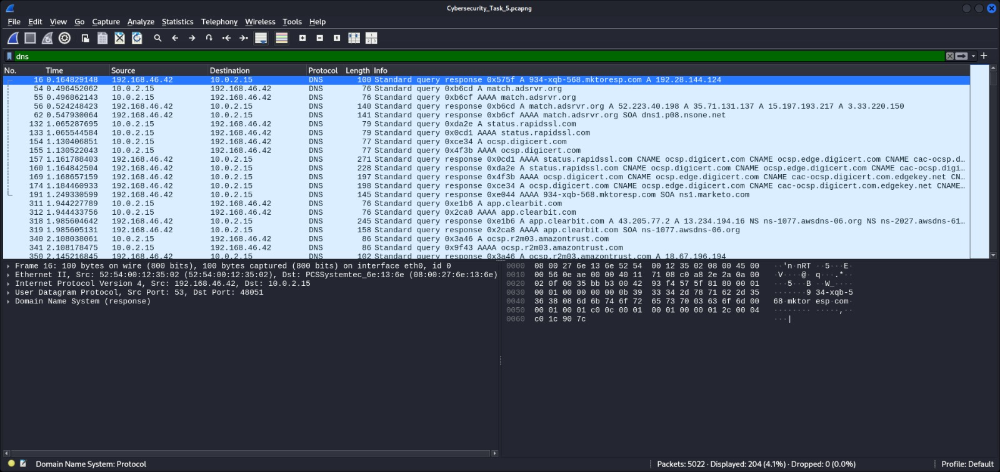
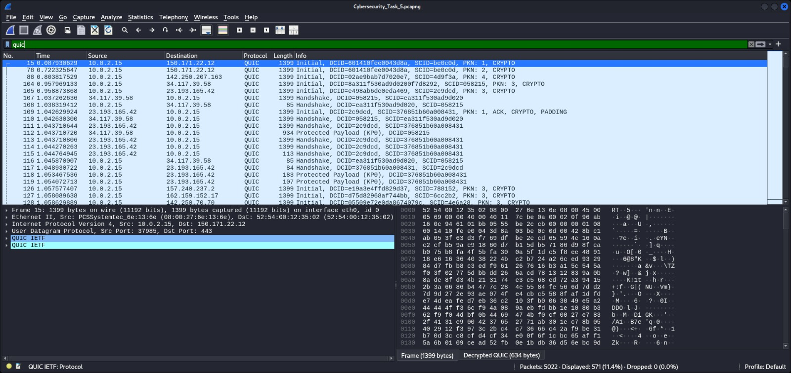
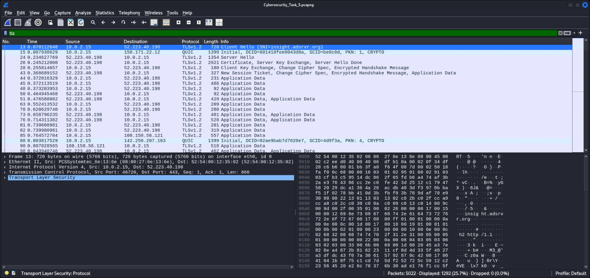

# CyberSecurity_Task_5
Task 5 – Capture and Analyze Network Traffic Using Wireshark

## Objective
Capture live network packets and identify basic protocols and traffic types to develop practical packet analysis skills and protocol awareness.

## Tools Used
- **Wireshark** (Free, https://www.wireshark.org/)
- OS: Kali Linux

## Steps Performed

1. **Installed Wireshark**
   - Installed Wireshark using the package manager on Kali Linux.

2. **Started Capture**
   - Selected the **active network interface (eth0)** and clicked the **Start Capturing** button.

3. **Generated Traffic**
   - Opened websites in a browser.
   - Initiated background requests to trigger DNS lookups and HTTPS connections.

4. **Stopped Capture**
   - Stopped capturing after around 1–2 minutes.

5. **Applied Filters to Identify Protocols**
   - `dns` – Domain Name System queries and responses.
   - `quic` – QUIC protocol traffic over UDP.
   - `tls` – TLS handshake and encrypted data.

6. **Saved Capture File**
   - Exported as `Cybersecurity_Task_5.pcapng`.

## Protocols Identified

### 1. **DNS (Domain Name System)**
- **Purpose:** Resolves domain names to IP addresses.
- **Example Packet:**
  - **Source:** `192.168.46.42`
  - **Destination:** `10.0.2.15`
  - **Type:** Standard query response for `934-xqb-568.mktorep.com` → `192.28.144.124`
- **Screenshot:**  
  

### 2. **QUIC**
- **Purpose:** Modern transport protocol designed by Google, runs over UDP, often used for HTTP/3.
- **Example Packet:**
  - **Source:** `10.0.2.15`
  - **Destination:** `150.171.22.12`
  - **Info:** Initial packet with DCID and SCID, handshake & crypto setup.
- **Screenshot:**  
  

### 3. **TLS (Transport Layer Security)**
- **Purpose:** Encrypts communication over the network (HTTPS and secure protocols).
- **Example Packet:**
  - **Source:** `10.0.2.15`
  - **Destination:** `52.223.40.198`
  - **Info:** TLSv1.2 Client Hello to `insight.adsrvr.org`
- **Screenshot:**  
  

## Deliverables
- **Packet Capture File:** [Cybersecurity_Task_5.pcapng](Cybersecurity_Task_5.pcapng)
- **Screenshots:** DNS, QUIC, and TLS filtered captures.

## Summary of Findings
During this capture:
- DNS was actively used to resolve hostnames before initiating connections.
- QUIC protocol packets indicated encrypted, low-latency communication (likely HTTP/3 traffic).
- TLS packets confirmed encrypted HTTPS communication, including the initial handshake process.

**Outcome:**  
This task provided practical exposure to identifying and filtering different protocols in Wireshark, interpreting packet metadata, and recognizing how common internet protocols interact during web browsing.

